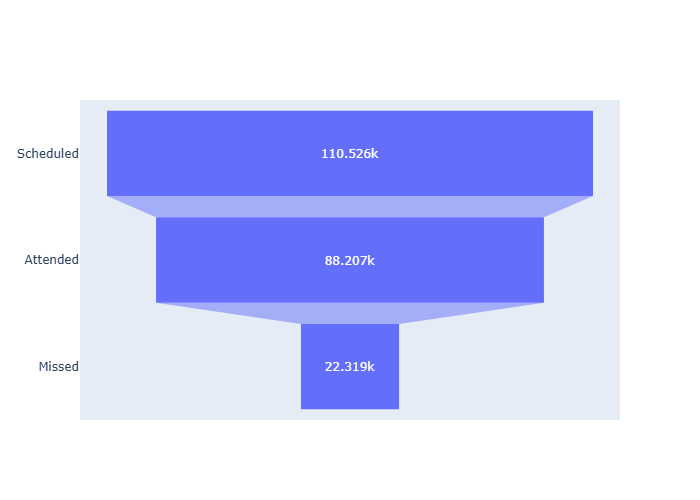
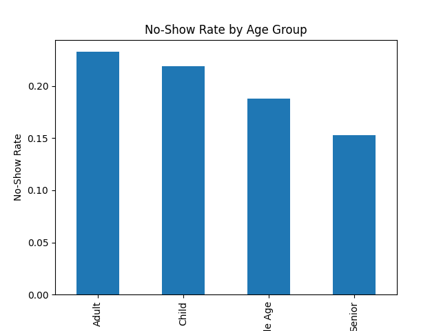
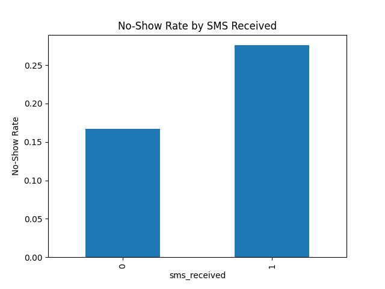
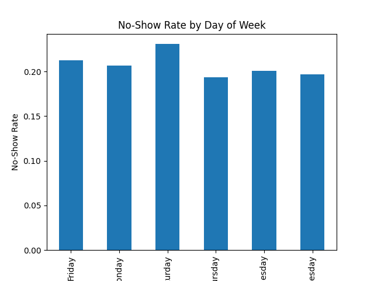

### Patient Flow & No-Show Analytics Dashboard

**Key Insight:**  Nearly 1 in 5 patients fail to attend scheduled appointments, highlighting a critical inefficiency in hospital operations.

**Executive Summary**
This project analyzes 110,000+ hospital appointments to uncover patterns behind patient no-shows and operational drop-offs. Using funnel analysis, behavioral segmentation, and an interactive Streamlit dashboard, the project identifies waiting time and patient behavior as primary drivers of missed appointments, and proposes practical mitigation strategies to improve attendance and resource utilization.
The Business Problem
Missed appointments are not just a data issue — they directly impact hospital efficiency: Idle doctor time Increased operational costs Reduced patient throughput
For hospital administrators and scheduling teams, understanding where and why patients drop off is essential for improving system performance.

**1.	Funnel Analysis**

 
Inference: Out of 110,526 scheduled appointments, only 88,207 were attended, resulting in a ~20% drop-off rate The drop occurs entirely at the final stage (Scheduled → Attended), indicating a post-booking behavioral problem rather than acquisition issue This suggests that improving patient follow-through (reminders, scheduling experience) will have the highest impact

**2.	No-Show by Age Group**

 
Inference: Adults and children exhibit the highest no-show rates (~22–23%) Seniors show significantly lower no-show rates (~15%), indicating higher commitment or dependency on care This highlights the need for age-specific engagement strategies, especially targeting working-age adults and parents

**3.	SMS Reminder Effectiveness**

 
Inference: Surprisingly, patients who received SMS reminders show a higher no-show rate (~27%) compared to those who did not (~17%) This indicates that SMS reminders are likely being sent to already high-risk patients, or are ineffective in timing/content Suggests the need to re-evaluate reminder strategy rather than relying on SMS alone

**4.	No-Show by Day of Week**

 
 
Inference: No-show rates vary across the week, with mid-week days (especially Tuesday/Wednesday) showing higher drop-offs (~23%) Thursday shows the lowest no-show rate (~19%), indicating better patient compliance This suggests an opportunity to redistribute appointments toward lower-risk days and avoid overloading high-risk days

**5.	Dashboard Preview**
 
Inference: The dashboard integrates funnel analysis, behavioral segmentation, and filtering, enabling stakeholders to: Identify high-risk segments in real time Compare performance across demographics Translate insights into actionable decisions

## Mitigation Strategy

1. Reduce Waiting Time (Primary Driver)
•	Prioritize appointments within 3–5 days
•	Optimize scheduling pipelines to reduce backlog

2. Improve Reminder System
•	Send reminders 24 hours before appointment
•	Add same-day follow-up notifications
•	Consider multi-channel reminders (SMS + app/email)

3. Target High-Risk Segments
•	Identify patients with long wait times
•	Provide flexible rescheduling options

4. Optimize Scheduling Strategy
•	Introduce controlled overbooking based on historical no-show rates
•	Balance patient load with predicted attendance

### Methodology

**Data Processing**
•	Cleaned and standardized dataset
•	Converted datetime features
•	Engineered features:
o	waiting_days
o	age_group
o	appointment_dayofweek

**Analysis Approach**
•	Funnel analysis
•	Segmentation analysis
•	Behavioral trend identification

**Tools & Technologies**
•	Python (Pandas, NumPy)
•	Plotly (Visualization)
•	Streamlit (Dashboard Development)

**Limitations & Next Steps**
**Limitations**
•	No geographic data for regional insights
•	No patient history for repeat behavior analysis

**Future Improvements**
•	Build predictive model for no-show risk
•	Integrate real-time scheduling data
•	Enhance dashboard with trend tracking

**Project Structure**
hospital_funnel/
├── data/
├── scripts/
├── dashboard/
├── results/
└── README.md

**Key Takeaway**
This project demonstrates the ability to:
•	Translate healthcare data into meaningful insights
•	Identify operational inefficiencies through funnel analysis
•	Build interactive dashboards for decision-making
•	Recommend actionable strategies grounded in data
